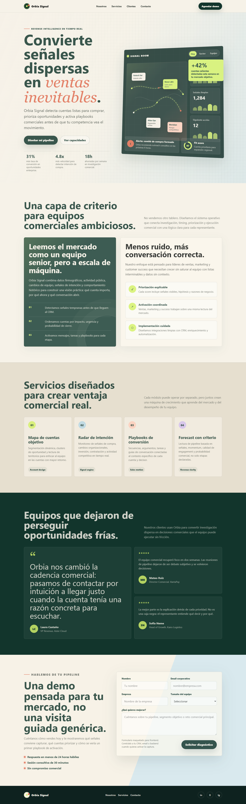

# PFO2: Prompt Engineering en Agentes de IA

Repositorio de la Práctica Formativa Obligatoria 2. El objetivo de este proyecto es diseñar y estructurar un único prompt inicial de alta precisión para generar una Landing Page, ejecutándolo en dos agentes de desarrollo distintos para comparar su capacidad de resolución autónoma.

## Datos del estudiante

- Nombre y apellido: Maria Carolina Corradi
- Materia: Desarrollo de Sistemas Web (Front End)
- Comision/curso: Comisión de los Viernes
- Docente: Completar
- Fecha de entrega: Completar

## Deploy unificado

🔗 **https://pfo2-prompt-engineering.vercel.app/**

El enlace dirige a la portada principal que contiene los accesos al texto del prompt y a las dos Landing Pages generadas

## Agentes y modelos

- Primer Agente: Codex Curador
- Modelo utilizado: GPT-5
- Sitio generado: `agente-1/index.html`

- Segundo Agente: Cursor 
- Modelo utilizado: Composer 2.5 Fast
- Sitio generado: `agente-2/index.html`

## Prompt exacto utilizado

```text
Eres un experto desarrollador frontend y diseñador UI/UX especializado en landing pages de alta conversión. Escribes HTML/CSS/JavaScript limpio y semántico, con un mucho detalle para un diseño visual distintivo. Evitas a siempre estéticas genéricas de "contenido generado por IA".
Construye una landing page completa y lista para producción en un único archivo HTML autocontenido. Incluye todo el CSS y JavaScript inline. Que sea muy profesional: crea una implementación completa y visualmente impactante que sorprenda y genere admiracion.  Esta landing page será la primera presentacion para clientes potenciales. Un diseño genérico y olvidable perjudicará la conversión. El resultado debe sentirse diseñado genuinamente para el producto específico, no como una plantilla generica que se replique todo el tiempo. 
Requisitos mínimos de la Landing Page a generar:
○ Cabecera (Header con menú de navegación).
○ Hero Section (Sección principal con título impactante y botón de llamada a la acción - CTA).
○ Descripción / Sobre Nosotros.
○ Sección de Servicios o Características principales.
○ Testimonios o Reseñas de clientes.
○ Formulario de contacto (Maquetado visual, no requiere funcionalidad backend).
○ Pie de página (Footer) con enlaces a redes sociales.
```

## Capturas de pantalla

Capturas incluidas en el repositorio:




## Estructura del proyecto

```text
.
|-- index.html
|-- prompt.txt
|-- assets/
|   |-- script.js
|   `-- styles.css
|-- agente-1/
|   `-- index.html
|-- agente-2/
|   `-- index.html
`-- screenshots/
    |-- landing-agente-1.png
    `-- landing-agente-2.png
```
